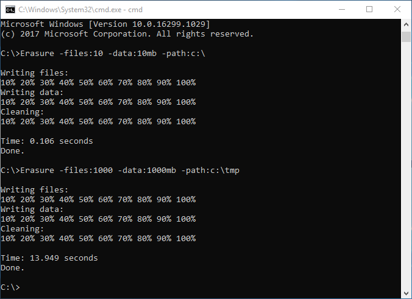

# Erasure
Erasure is a program that overwrites empty space on disk.

**Documentation:** \
[https://github.com/Muhammd/Erasure/raw/master/Erasure.pdf)

The empty space on disks can contain sensitive data and information that can be recovered with recovery software and forensics, this can be security and privacy risk. \
To protect privacy and security the remaining data on empty space on disks has to be overwritten.

**Features**
- It is safe, does not overwrite existing files, and uses operating system for overwrite.
- Can be used on different file systems and operating systems, as NTFS EXT4 FAT Windows Linux.
- Different options can be specified, as block size, number of files, quantity of data.
- It is free and open source with general public licence.

**Example** \
// Write 10 files and 10Mb data, on Windows \
Erasure -files:10 -data:10mb -path:c:\

// Write random data, block size 512 bytes on Linux \
Erasure -rand -block:512 -files:10 -data:10mb -path:/mnt/usbdisk/

// Run directly Erasure.c source code with Tiny C compiler \
tcc -run Erasure.c -h

